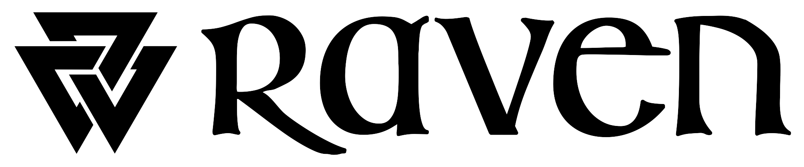

<p align="center">

</p>

[Raven](https://mikeinnes.io/posts/raven/) is the next web-native language. It combines the flexibility of a scripting tool with the ambition of a systems one. It [plays well with JavaScript](https://github.com/Unkindnesses/raven-js-template) (or TypeScript) and mitigates its weaknesses with proper data types, modern syntax and a helpful compiler. And it inherits the great strengths of the web platform, running everywhere with painless sandboxing – whether you want to build interactive browser experiences, deploy serverless cloud functions, or safely execute code written by LLMs.

Start with the [language tour](https://mikeinnes.io/posts/raven-tour/) for a feel, then visit the [docs](https://github.com/Unkindnesses/raven/blob/master/DOCS.md) to get running on your machine. I recommend a browse of the [standard library](/common) to see how Raven looks in practice. For example, our [complex numbers](common/numbers/complex.rv) or [malloc](common/wasm/malloc.rv). You can also join our [discord](https://discord.gg/ATMFG4QEsh) (fair warning, it's quiet right now).

Some features. Raven is concise, high-level and easy to read. It supports gradual type annotations, but without them code is fully type-inferred for both performance and correctness. We have real data types and good control over layout and allocations (ints, bytes etc – [defined](common/integer.rv) in the standard library!). Compound types are values first, with multi-dispatch and pattern matching. What we don't have is [function colouring](https://journal.stuffwithstuff.com/2015/02/01/what-color-is-your-function/): any code can suspend without complications. JS objects and interop are first class, so Raven can interact with the DOM or other JS interfaces without glue. The compiler is fully incremental, for fast builds, editor tooling and live REPL/notebook experiences. Errors come with reasonable stack traces and debugger support.

Some flaws. It's early days and if you try Raven out you're beta testing. Expect bugs! There are lots of things we're ambitious about but still working on. Currently we only compile one file at a time, for example. Modules, packages and separate compilation are on the roadmap. [Editor tooling](https://github.com/Unkindnesses/vscode-raven) is basic for now (mostly syntax highlighting). The standard library is sparse and missing core data structures, like hash maps. Interfaces will change and break.

But we think it's fun all the same.

You can get going quickly with `npm i -g @unkindnesses/raven`. Then you can launch a repl (it makes a nifty little calculator):

```bash
$ raven
> 2+2
4
> Complex(1, 2) / 2
0.5 + 1.0im
> factorial(big(50))
big(30414093201713378043612608166064768844377641568960512000000000000)
```

Or run a hello world program:

```bash
$ cat hello.rv
println("Cacaw, World!")
$ raven hello.rv
Cacaw, World!
```

You can explicitly compile and run a wasm binary. `fib.rv`:

```rust
fn fib(n) { fib(n-1) + fib(n-2) }
fn fib(1) { 1 }
fn fib(0) { 0 }

fn fibSequence(n) {
  xs = []
  for i = range(1, n) {
    append(&xs, fib(i))
  }
  return xs
}

show fibSequence(10)
```

```bash
$ raven build fib.rv
$ raven fib.wasm
fibSequence(10) = [1, 1, 2, 3, 5, 8, 13, 21, 34, 55]
```

It may entertain you to create a self-contained JS file (with the shebang and permissions needed to run like a binary).

```bash
$ raven build --js --embed hello.rv -o hello
$ ./hello
Cacaw, World!
```

Here's a brainfuck interpreter:

<details>
<summary><code>brainfuck.rv</code></summary>

```ruby
bundle Instr {
  Left(), Right()
  Inc(), Dec()
  Read(), Write()
  Loop(body: List)
}

fn parse(code) {
  stack = []
  body = []
  for ch = code {
    if ch == "<" {
      append(&body, Left())
    } else if ch == ">" {
      append(&body, Right())
    } else if ch == "+" {
      append(&body, Inc())
    } else if ch == "-" {
      append(&body, Dec())
    } else if ch == "," {
      append(&body, Read())
    } else if ch == "." {
      append(&body, Write())
    } else if ch == "[" {
      append(&stack, body)
      body = []
    } else if ch == "]" {
      loop = Loop(body)
      body = pop(&stack)
      append(&body, loop)
    }
  }
  return body
}

bundle Tape(data: List, i: Int64)

fn Tape() { Tape([0], 1) }

fn Tape(xs, i)[] { xs[i] }

fn left(&tape: Tape(xs, i)) {
  i = i - 1
  if i < 1 { abort("Tape error") }
  tape = Tape(xs, i)
}

fn right(&tape: Tape(xs, i)) {
  i = i + 1
  if i > length(xs) { append(&xs, 0) }
  tape = Tape(xs, i)
}

fn inc(&tape: Tape(xs, i)) {
  xs[i] = xs[i]+1
  tape = Tape(xs, i)
}

fn dec(&tape: Tape(xs, i)) {
  xs[i] = xs[i]-1
  tape = Tape(xs, i)
}

fn eval(&tape: Tape, instr: Instr) {
  match instr {
    let Left()  { left(&tape) }
    let Right() { right(&tape) }
    let Inc()   { inc(&tape) }
    let Dec()   { dec(&tape) }
    let Write() { print(js().String.fromCharCode(tape[])) }
    let Loop(body) {
      while tape[] != 0 {
        interpret(&tape, body)
      }
    }
  }
  return
}

fn interpret(&tape: Tape, code) {
  for instr = code {
    eval(&tape, instr)
  }
  return tape
}

fn interpret(code) {
  interpret(Tape(), code)
}

{
  code = parse(readFile(args()[3]))
  interpret(code)
}
```

</details>

```bash
$ raven build --js --embed brainfuck.rv -o bf
$ cat hello.bf
++++++++[>++++[>++>+++>+++>+<<<<-]>+>+>->>+[<]<-]>>.>---.+++++++..+++.>>.<-.<.+++.------.--------.>>+.>++.
$ ./bf hello.bf
Hello World!
```
